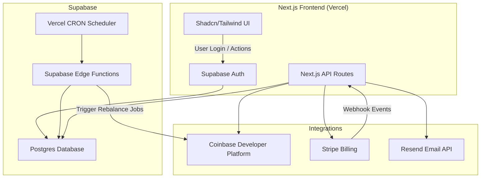

# 💹 AutoBalance – Automated Crypto Portfolio Rebalancing SaaS

An open-source SaaS built with **Next.js**, **Supabase**, and **Coinbase Developer Platform (CDP)** to automate crypto portfolio management.

---

## 🧠 Architecture Overview



---

## 🚀 Tech Stack

- **Framework:** Next.js 15
- **Database:** Supabase (Postgres + Auth)
- **Styling:** Shadcn/UI + Tailwind CSS
- **Email:** Resend
- **Payments:** Stripe + Coinbase Pay
- **Scheduler:** Vercel CRON + Supabase Edge Functions
- **Package Manager:** pnpm (`pnpm dlx` for scripts)

---

## 🧰 Local Setup

```bash
git clone https://github.com/yourname/autobalance.git
cd autobalance
pnpm install
pnpm dev
```

### Environment Variables

| Name                            | Description                     |
| ------------------------------- | ------------------------------- |
| `NEXT_PUBLIC_SUPABASE_URL`      | Supabase project URL            |
| `NEXT_PUBLIC_SUPABASE_ANON_KEY` | Supabase public key             |
| `SUPABASE_SERVICE_ROLE_KEY`     | Service role key                |
| `STRIPE_SECRET_KEY`             | Stripe API key                  |
| `COINBASE_API_KEY`              | Coinbase Developer Platform key |
| `RESEND_API_KEY`                | Resend email key                |

---

## 💸 Monetization

| Tier    | Features                        | Price  |
| ------- | ------------------------------- | ------ |
| Free    | Manual rebalance only           | $0     |
| Pro     | Auto weekly rebalancing         | $10/mo |
| Premium | Daily rebalancing, multi-wallet | $30/mo |

Payments handled via **Stripe Billing**, optional **Coinbase Pay** support.

---

## 🕒 CRON Example

```json
{
  "crons": [
    {
      "path": "/api/cron/rebalance",
      "schedule": "0 8 * * 1"
    }
  ]
}
```

---

## 📬 Emails

Sent using **Resend** for notifications and summaries.

---

## 🧾 License

MIT License © 2025 Perry Fardella
