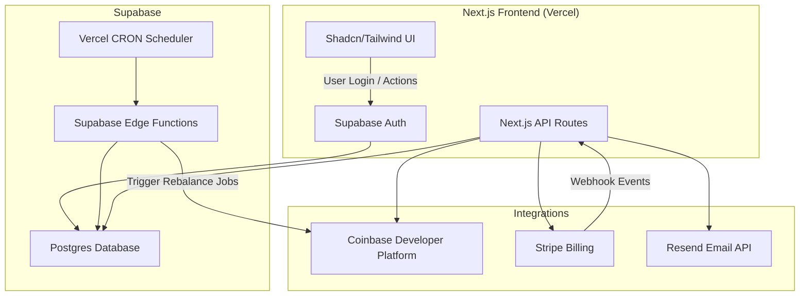

# 💹 Crypto Rebalance SaaS – Product Requirements Document (PRD)

## 1. Overview

**Product Name:** AutoBalance  
**Goal:** An automated crypto portfolio rebalancing platform that helps users maintain their desired allocation ratios across tokens.  
**Platform:** Web-based SaaS built with **Next.js**, **Supabase**, and **Vercel**, leveraging the **Coinbase Developer Platform (CDP)** for wallet management, trading, and payments.

---

## 2. Problem Statement

Crypto investors often diversify portfolios across multiple assets. Over time, price volatility causes allocations to drift from targets. Manual rebalancing is time-consuming, error-prone, and costly.

**AutoBalance** solves this by automatically rebalancing users’ portfolios based on pre-set target allocations — safely, transparently, and without users needing to move funds off-chain.

---

## 3. Core Features

| Feature                       | Description                                                                                 |
| ----------------------------- | ------------------------------------------------------------------------------------------- |
| 🔗 **CDP Integration**        | Connect to Coinbase wallets, view balances, execute swaps.                                  |
| ⚖️ **Auto Rebalancing**       | Define target allocations and auto-rebalance periodically.                                  |
| ⏰ **Scheduled CRON Jobs**    | Use **Vercel Cron Jobs** or **Supabase Edge Functions** to trigger rebalances daily/weekly. |
| 💸 **Crypto & Fiat Payments** | Users can pay via **Stripe** (fiat) or **Coinbase Pay** (crypto).                           |
| ✉️ **Email Notifications**    | Use **Resend** for transactional emails (rebalance summary, alerts).                        |
| 🪄 **Modern UI**              | Built with **Shadcn/UI**, **Tailwind CSS**, and **Framer Motion** for smooth UX.            |
| 🔐 **Authentication**         | Supabase Auth with optional Coinbase OAuth.                                                 |
| 🧾 **Logging & History**      | Track rebalances, fees, and performance in Supabase DB.                                     |

---

## 4. System Architecture



---

## 5. Tech Stack

| Layer               | Technology                                         | Notes                             |
| ------------------- | -------------------------------------------------- | --------------------------------- |
| **Frontend**        | Next.js 15, Shadcn/UI, Tailwind CSS, Framer Motion | Modern reactive UI                |
| **Backend**         | Supabase (Auth, Database, Edge Functions)          | Scalable Postgres + serverless    |
| **Payments**        | Stripe + Coinbase Pay                              | Subscription + crypto support     |
| **Emails**          | Resend                                             | Transactional & marketing emails  |
| **Scheduler**       | Vercel CRON + Edge Functions                       | Timed rebalances                  |
| **Deployment**      | Vercel                                             | Global edge hosting               |
| **Package Manager** | pnpm                                               | `pnpm dlx` for command executions |

---

## 6. Pricing & Monetization

| Tier        | Features                                             | Pricing | Notes       |
| ----------- | ---------------------------------------------------- | ------- | ----------- |
| **Free**    | Manual rebalancing only                              | $0      | Basic use   |
| **Pro**     | Auto rebalancing (weekly) + email alerts             | $10/mo  | Most users  |
| **Premium** | Custom schedules, multi-wallet, performance tracking | $30/mo  | Power users |

**Payment Flow:**

- Use **Stripe Subscriptions** for recurring billing.
- Optionally add **Coinbase Pay** for crypto-based subscription payments.

---

## 7. Vercel & Supabase Functions (CRON Jobs)

### 🔄 **Vercel CRON Jobs**

Configure in `vercel.json`:

```json
{
  "crons": [
    {
      "path": "/api/cron/rebalance",
      "schedule": "0 8 * * 1"
    }
  ]
}
```

### ⚙️ **Supabase Edge Functions**

For additional compute-heavy tasks like executing rebalances or portfolio analysis.

---

## 8. MVP Scope

- Coinbase OAuth login
- Manual + scheduled rebalancing
- Stripe subscriptions
- Resend email summaries
- Deployed via Vercel (with CRON)
- Basic analytics dashboard

---

## 9. Launch Plan

1. Build MVP in Next.js + Supabase.
2. Integrate CDP + Stripe + Resend.
3. Deploy on Vercel.
4. Test CRON + rebalancing.
5. Launch waitlist + collect feedback.

---

## 10. Success Metrics

- 100 active portfolios in 3 months
- 5% MRR growth MoM
- 99% rebalance success rate
- 70% user retention (30 days)

---

_Built by Perry Fardella – 2025_
